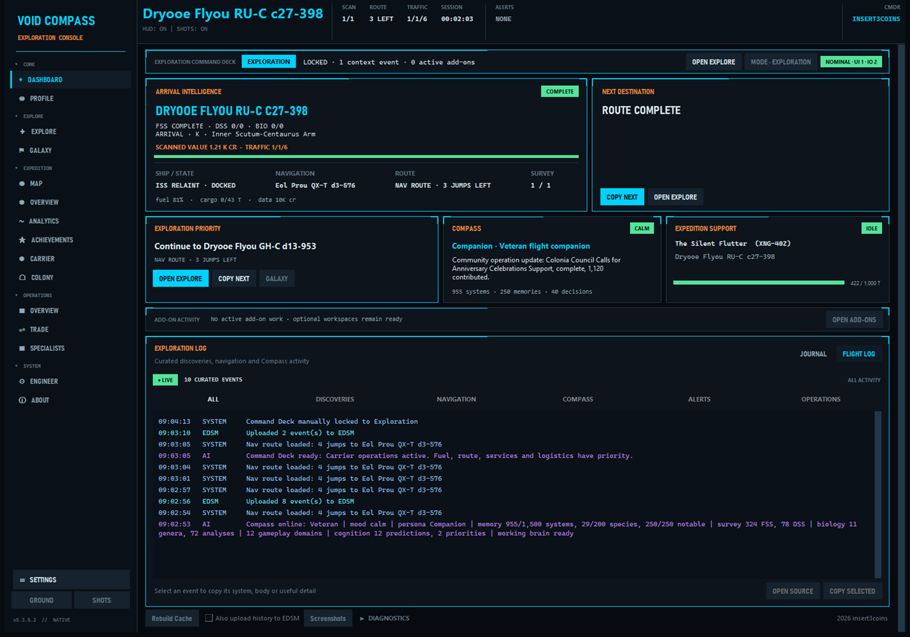
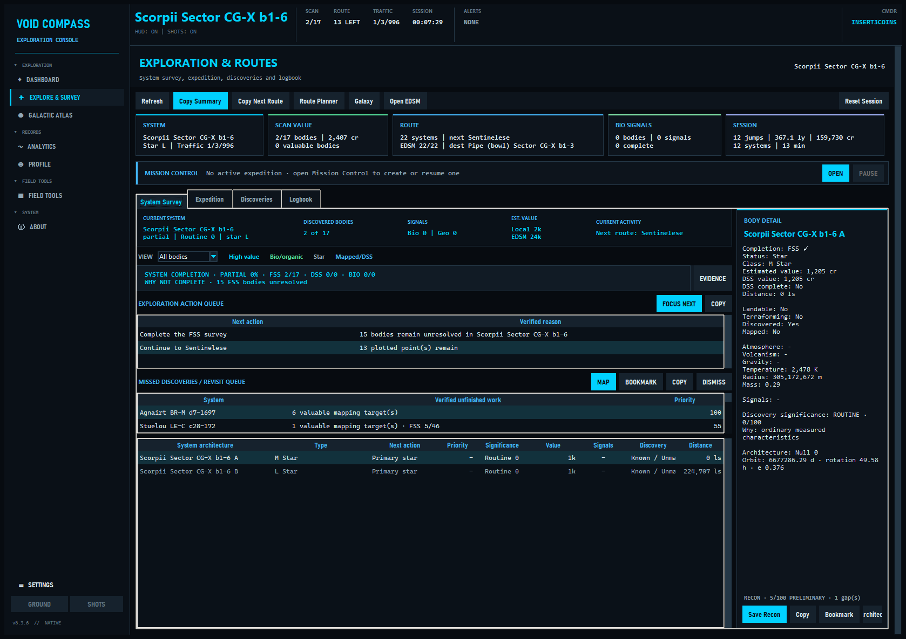
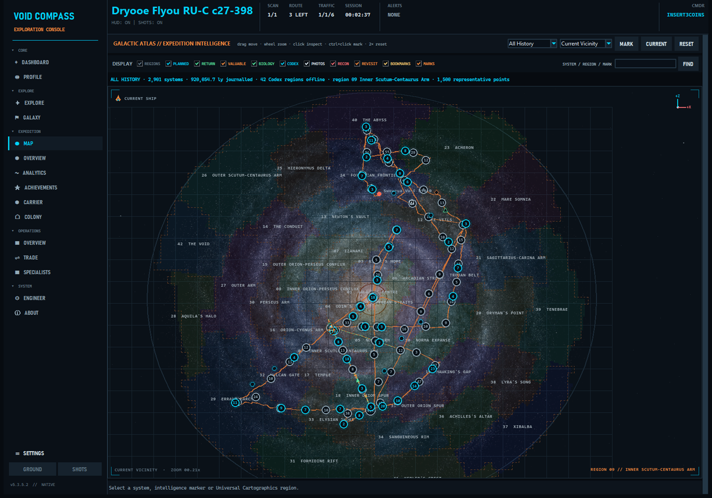
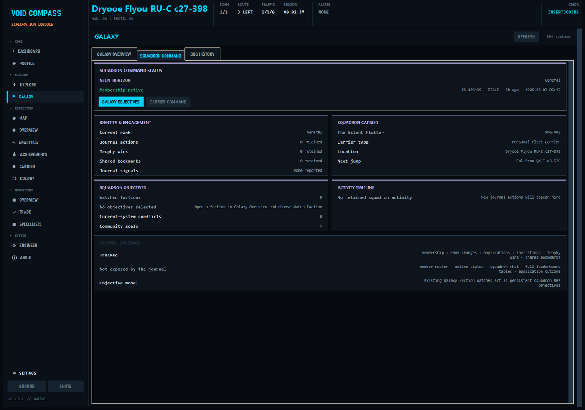
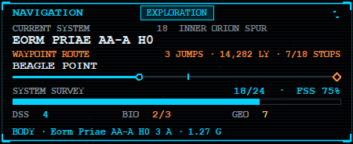
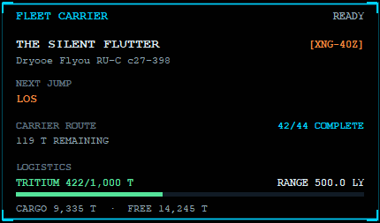
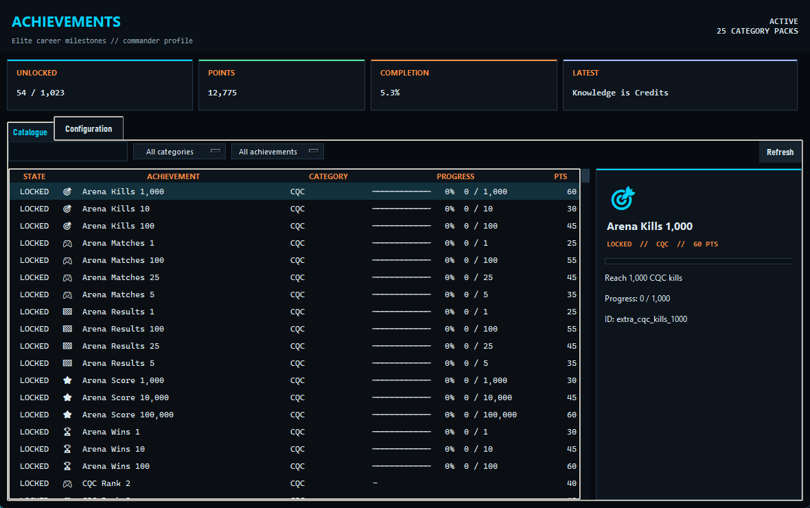

# Void Compass

**Current version: 5.3.5.5**

Void Compass is an exploration-first companion for Elite Dangerous. It turns Frontier's live journal, status and companion files into a persistent command dashboard, deep survey intelligence, expedition planning, native in-game overlays and a local cockpit companion.

[Download releases](https://github.com/insert3coins/VoidCompass/releases) · [Read the wiki](https://github.com/insert3coins/VoidCompass/wiki) · [Report an issue](https://github.com/insert3coins/VoidCompass/issues/new/choose)

Windows is the primary native release. A native Linux x86-64 build is also available for testing; neither build requires Python to be installed.

## At a glance

- **Exploration command deck** — live flight, route, traffic, survey, discovery value, expedition and next-action intelligence in one view.
- **Deep Survey** — explainable FSS, DSS, biological and geological progress; valuable bodies; system architecture; revisit targets; Colonisation Recon and a searchable discovery archive.
- **Galactic Atlas** — a fully offline Milky Way map with all 42 Universal Cartographics regions, routes, travel history, smart clusters, intelligence layers and commander annotations.
- **Native overlays** — themed, profile-aware HUDs with mouse passthrough, global hotkeys and a visual Overlay Layout Studio.
- **Compass companion** — local deterministic cognition, bounded commander memory, 15 personas and optional cached Piper voices without an LLM or GPU workload.
- **Optional operations** — focused Trade Assist, Mining, Combat/AX, Engineering, Powerplay, Fleet/Squadron Carrier and colony tools remain available without displacing exploration.

The Dashboard stays exploration-first, then adapts from verified journal activity for Trade, Mining, Combat, Ground, Engineering, Powerplay, Carrier, Colony and station operations. Automatic mode can be manually locked, while its curated Flight Log keeps useful events separate from Frontier's raw journal stream.



*The current exploration dashboard with Arrival Intelligence, route progress, Compass context, expedition support and the curated Flight Log.*

## Command workspaces

| Group | Direct workspaces |
| --- | --- |
| **Core** | Dashboard and Profile. |
| **Explore** | Explore and Galaxy. Explore uses four clear pages—System Survey, Expedition, Discoveries and Logbook—without nested Survey or Chronicle tabs; named Mission Control lives inside Expedition. |
| **Expedition** | Expedition overview plus direct Analytics, Achievements, Carrier and Colony access. |
| **Operations** | Operations overview plus direct Trade and Specialists access, including Mining and Combat/AX. |
| **System** | Engineer and About. |

Every group starts expanded, can be collapsed deliberately, remembers that choice per commander and remains reachable through a themed scrolling rail on smaller windows. Full secondary workspaces are still created only when first opened.

### Deep Survey Intelligence

Explore integrates profile-local Deep Survey intelligence directly into its four workflow pages, built from Frontier journal facts:

- **System Survey** combines the current body list, explainable FSS/DSS/biology completion matrix, ranked action queue, architecture, stellar wonders and Colonisation Recon in one filterable view. Its evidence inspector compares live, profile-database, Deep Survey, cached EDSM and traffic facts and can repair only the selected system from local journals without triggering uploads.
- **Expedition** uses one compact section switcher for route overview, waypoints, neutron planning, named Mission Control, and an interactive Elite-style Galactic Atlas with route intelligence.
- **Discoveries** is one searchable archive for system history, valuable bodies, all 42 passport regions, Codex discoveries, FSS signals, DSS probe efficiency and screenshot metadata; image previews load only when selected, while system records can be copied or opened directly in EDSM.
- **Logbook** places the live trip summary, reliable resume checkpoint, automatic milestones and retained session debriefs together instead of separating them across Chronicle tabs. Its Explorer Data Vault separates unsold cartographic value, biological value and possible first-discovery bonus from recent sale evidence, while reports can be saved as Markdown or a themed local PNG share card.



*System Survey combines verified completion, the action queue, missed-discovery revisit work, system architecture, body detail and Colonisation Recon.*

Named expeditions persist across sessions with journal-verified goals, multi-session statistics, prioritised bookmarks and revisit targets. Departing a system can add worthwhile unfinished mapping, biology or FSS evidence to the Missed Discoveries queue, which links directly to its Revisit map layer and expedition bookmarks. Their active strip remains visible across Explore, while Compass can brief the next objective and announce verified completion without routine feed spam. The flat Galactic Atlas combines original game-style Milky Way artwork with the complete 42-region Universal Cartographics layout. It works fully offline, supports retained-system, region and annotation search, natural drag movement, cursor-centred zoom, Atlas/Route Focus/Current Vicinity framing and an in-place full-window focus mode, and overlays profile-local travel breadcrumbs, game and waypoint routes, direction arrows, an optional return trail plus Valuable, Biology, Codex, Photo, Recon, Revisit, Bookmark and custom Annotation records. Notes, danger warnings, regions of interest, survey targets and waypoints can be placed directly on the map; zoom-aware cluster badges keep dense histories legible, while a restrained ship pulse, planned-route tracer and next-waypoint beacon add live navigation context without rebuilding the cached atlas. Visible-image cropping keeps navigation responsive, while expedition plans can be exchanged as VoidCompass JSON or newline waypoint lists and full locally generated Markdown reports include the named route, objectives, evidence and bookmarks.



*The integrated Galactic Atlas showing the offline Milky Way layer, 42 regions, profile-local travel history, route tracers, clusters, filters and current-ship position.*

Explore remembers its active page, survey/discovery filters and Expedition section independently for each commander. Colonisation Recon produces a conservative survey-readiness dossier, saved candidate list and direct Architect Command handoff; it does not claim that survey readiness guarantees game eligibility. System architecture follows journal `Parents` relationships, while wonders detection flags unusual measured characteristics without inventing missing orbits.

Existing journals are indexed on a background worker the first time Deep Survey opens for a profile. Stored collections, expedition facts and visible rows are bounded so a long expedition does not turn map, ledger or startup recovery into a cockpit stall.

Optional **Trade Assist** stays intentionally focused: **Sell My Cargo** finds practical buyers, **Find a Trade** searches every eligible departure market in a typed system—or galaxy-wide when the system is blank—**Current Run** compares the selected plan with journal-realized profit, and **Trade Log** preserves commander-local purchases, sales, locations and route context with configurable retention. `USE CURRENT` is deliberate rather than automatic. Filters cover cargo capacity, route distance, quote age, minimum supply/demand, station arrival distance (unlimited by default), pad size, surface stations, carriers, full loads and real return loops, with one-click restoration of search defaults. The responsive results table fits the embedded page, supports sorting directly from every heading and expands to 50 alternatives; full station, price, supply/demand, confidence and profit/hour evidence remains in the scrollable selected-route detail. The optional Trade Route HUD tracks route stage, outbound/return cargo, hold capacity and expected-versus-realized profit on screen. Mission and stolen cargo are excluded from ordinary advice. Searches use request-driven [Ardent Insight](https://ardent-insight.com/) data held only in a short memory cache—there is no galaxy market download or local price database to maintain. Visited-station EDDN uploads remain an independent optional community service.

### Squadron Command

Galaxy includes a dedicated Squadron Command page for journal-backed membership, named rank, Squadron ID, applications, invitations, promotions, trophy wins, shared bookmarks and a bounded activity timeline. Existing faction watches become persistent squadron BGS objectives, while Squadron Carrier operations remain connected to Carrier Command.

Frontier does not publish a complete member roster, online presence, squadron chat or full leaderboard tables through the journal, so Void Compass leaves those fields unavailable instead of inventing them.



*Current Squadron Command within the unified navigation shell; unavailable journal facts remain clearly identified instead of being inferred.*

### Mining Specialist

Mining now lives inside Specialist Console as the single authoritative workflow. Runs start manually or from journal mining activity and record prospector quality, refinery and cargo yield, core cracks, limpets and their observed cost, attributable commodity sales, hourly performance and per-commander history. It remains directly available from the Operations navigation group.

### Specialist Console

Specialists remains local and journal-driven. Mining runs track confirmed refinery yield, prospector quality, limpet economics and attributable sales; Combat/AX records observed loadout readiness, ammunition snapshots, claims, damage, synthesis and recent sorties. Carrier Command plots Fleet and Squadron Carrier routes through Spansh, can import an existing Fleet Carrier result URL or job, marks journal-confirmed arrivals complete and advances Copy Next to the first pending jump, and carries route/fuel progress into the carrier overlay. Its Tritium view finds known hotspots around the carrier through Spansh and can copy or add a selected system to the expedition; its Cargo view combines the exact journal cargo total with an explicitly labelled manual/observed commodity manifest and active market orders. Exobiology keeps body-local samples, manual pins and GeoJSON exports, while selected coordinates are handed to the existing Ground tool for navigation.

## Adaptive Command Deck

Void Compass keeps the Dashboard centred on exploration: current flight, route or waypoint progress, system survey, valuable discoveries, expedition support and the next verified exploration priority remain prominent. It still detects Mining, Trade, Combat, Ground, Engineering, Powerplay, Carrier, Architect and station activity from live journal evidence, but presents those optional workflows in a compact add-on strip and their dedicated workspaces instead of displacing exploration.

Each mode can apply a focused overlay scene while gravity, toast and heartbeat safety feedback remains available. Automatic detection can be locked to a chosen mode per commander, and overlay scenes or deterministic Compass briefings/debriefs can be disabled independently in **Settings → Command Deck**.

## Native overlays

Every overlay can be enabled independently, dragged to a saved position and styled with the active theme:

- Readable Classic Navigation HUD with the original stacked cockpit structure, a large current-system readout, distinct Game/Waypoint/Void route context, distance-proportional cyan/orange hop pips, permanent FSS progress, live fuel plus biology/geology evidence, far-right day/week/total traffic, state-aware sampling/body/surface/docking context, a 9-point readability floor and optional CRT effects.
- Survey Operations with persistent body targets, biological and geological signals, species/sample progress, completed discoveries and notable-world value evidence; Navigation remains the single owner of system scan percentage.
- A dynamic Cargo Manifest with hold utilisation plus mission/stolen distinctions; Fleet/Squadron Carrier Command with jump, expedition, Tritium and capacity status; and Prospector Analysis with themed material composition, core and refinery evidence.
- System Intelligence, Station Link and profile-local Colony Logistics overlays for contextual system, market and construction work without duplicating the Navigation HUD.
- Gravity, touchdown/liftoff, on-foot and other low-noise safety notifications.
- Toast notifications and the journal/Compass heartbeat pulse.

**Settings → Core → Open Overlay Layout Studio** opens the single overlay-control workspace. Its Layout view enables or disables every module and provides a scaled desktop preview: drag overlay cards to position the real HUD windows without disabling mouse passthrough. Saved positions remain authoritative through dynamic redraws, and activity modes never hide an enabled overlay. Its Overlay Settings view owns passthrough, compact HUD, overlay text scale, alert policy, auto-hide timing, gravity threshold and Navigation HUD CRT controls. Layout snapping, resets and named commander-specific presets remain available alongside those controls; application scale and reduced motion remain under **Settings → Core → Accessibility**.

On Windows, profile-aware global shortcuts can open or close the Layout Studio and temporarily hide or restore all overlays while Elite has focus, with optional individual shortcuts for the main exploration and operations overlays. The low-conflict defaults are **Ctrl+Alt+Shift+F10** for Layout Studio, **Ctrl+Alt+Shift+F11** for all overlays and **Ctrl+Alt+Shift+F12** for a field bookmark at the current system/body; assignments can be changed or cleared on the dedicated **Settings → Hotkeys** page without changing which modules are enabled. Linux X11/XWayland builds retain borderless topmost overlays with opaque themed backgrounds; chroma transparency, mouse passthrough and system-wide shortcuts remain Windows-only.

| Navigation HUD | Fleet Carrier HUD |
| :---: | :---: |
|  |  |

*Current Navigation and Fleet Carrier overlays. Enabled overlays remain visible regardless of Dashboard mode and retain their commander-specific positions.*

## Achievements and commander profiles

Achievement progress, companion memory, named expeditions, bookmarks, Captain's Log, Deep Survey history, carrier state, engineering plans, mining history, routes and integration settings are separated by commander profile. The active commander is detected from the journal and can be changed without mixing personal data.

Commander Record can create SQLite-safe manual profile backups and schedule a restore for the next application start. VoidCompass also retains five rotating internal safety snapshots before version changes and cache rebuilds; a restore first preserves the replaced profile as a rollback snapshot.



## Compass cockpit companion

Compass runs locally without an LLM, Ollama service or GPU workload. Its bounded per-commander memory combines verified navigation, named-expedition objectives, survey, biology, mission, trade, mining, engineering, carrier, social and data-sale context.

The deterministic cognition engine learns personal baselines and whether advice was useful, varies verified wording, remembers notable episodes, chooses useful silence and supports 15 behavioural personas. Routine docking clears stale non-safety chatter and permits only useful contextual advice before a short quiet period; urgent safety callouts remain available. Optional Piper voice packs provide cached neural speech.

## Integrations

- **Elite journal and companion files** provide all live game state.
- **EDSM** upload and traffic lookup are optional and use per-commander credentials; accepted stored-fleet snapshots, ship movements and belt-cluster celestial scans are included while mining prospect events remain filtered.
- **Ardent Insight** supplies on-demand EDDN-backed buyers and sellers when a Trade Assist or Architect commodity search is requested.
- **EDDN** optionally receives visited-station market uploads from Void Compass; it is not required for online searches.
- **Spansh** supports neutron routes, ring/hotspot searches, trader lookups and integrated Fleet/Squadron Carrier route calculation.
- **Discord webhooks** announce personal or Squadron Carrier operations with compact event-specific, active-theme cards. Completed and current locations can link to EDSM, while a newly plotted jump remains plain text until arrival. Automatic posts keep only the jump, Tritium and relevant expedition context; a deliberate manual status post provides the fuller capacity, docking, service and route snapshot. User-entered notes cannot trigger Discord mentions, and carrier finances remain local.
- **Piper** voice packs are optional; regular system TTS remains available.

Void Compass does not require an account or Void Compass cloud database. It checks GitHub Releases for a newer version at startup; other network integrations only run when their associated feature is enabled or requested. Online market searches send Ardent Insight the reference system, commodity and search filters, never commander credentials or journal files.

## First run, recovery and diagnostics

New installations open a short themed setup for the Elite journal folder, overlays, mouse passthrough, Adaptive Command and optional voice. This is the only visible window and finishes before profile state, voice, overlays or journal catch-up start. Settings can rerun it at any time.

State-heavy journal bursts are buffered through a coalescing background writer, while one bounded dispatcher protects Tk from cross-thread UI work. Closing Void Compass immediately cancels active or queued voice work and uses one short, bounded final-state flush. A profile-local session marker detects an unclean shutdown and restores the last graceful cockpit snapshot while journal catch-up settles. Dashboard and Settings expose Command Health queue status.

**Settings → Diagnostics → Create Support Bundle** produces a ZIP in the `logs` folder with version and health information, sanitized runtime/crash diagnostics, and only journal event names and timestamps. It excludes raw journal payloads, commander identity, profile identifiers, credentials and webhook URLs.

Packaged releases create `config.json`, commander profiles and logs beside the executable. If journal detection fails, set `journal_path` in Settings. The normal Windows location is:

```text
C:\Users\<You>\Saved Games\Frontier Developments\Elite Dangerous
```

The native Linux x86-64 build is currently a **testing release**. It detects Elite running through Steam/Proton in standard Steam, Flatpak Steam and custom Steam-library prefixes. A typical journal path is:

```text
~/.local/share/Steam/steamapps/compatdata/359320/pfx/drive_c/users/steamuser/Saved Games/Frontier Developments/Elite Dangerous
```

Windows and Linux are packaged as separate native builds; the Linux application does not run inside Proton. Extract its `.tar.gz` into a writable folder, make `VoidCompass` executable if necessary, and run it alongside Elite. Piper playback uses the first available `pw-play`, `paplay`, `aplay` or `ffplay` command. On Windows, `build_linux.cmd` launches the default WSL distribution, installs missing Ubuntu/Debian Tk and venv prerequisites, and creates the native Linux testing archive and checksum; it may request the Linux sudo password on its first run. Native Linux maintainers can run `bash build_linux.sh` directly. The manual GitHub Actions workflow provides the same checksummed artifact because PyInstaller builds must be created separately on each operating system. Linux testers are encouraged to report distribution, desktop session and overlay details with any issue.

## Contributing and support

Bug reports and feature ideas use the repository's structured [issue forms](https://github.com/insert3coins/VoidCompass/issues/new/choose). Before contributing code, see [CONTRIBUTING.md](CONTRIBUTING.md) and the [Code of Conduct](CODE_OF_CONDUCT.md). Suspected vulnerabilities must be reported privately according to the [Security Policy](SECURITY.md).

## License

Copyright © 2026 insert3coins. Void Compass is free software released under the [GNU General Public License v3.0 only](LICENSE). You may use, study, modify and redistribute it under those terms; redistributed source or binaries must preserve the GPL and provide the corresponding source as required by the licence. The corresponding source is published at [github.com/insert3coins/VoidCompass](https://github.com/insert3coins/VoidCompass).

The packaged offline galactic-region raster retains its upstream MIT notice in [THIRD_PARTY_NOTICES.md](THIRD_PARTY_NOTICES.md).

## Disclaimer

Void Compass is an independent community project and is not affiliated with or endorsed by Frontier Developments. Elite Dangerous and its related marks belong to their respective owners.
