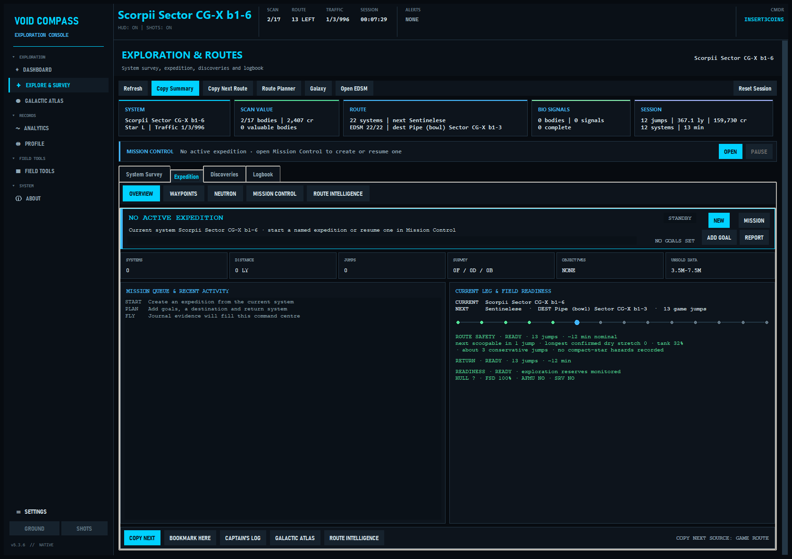
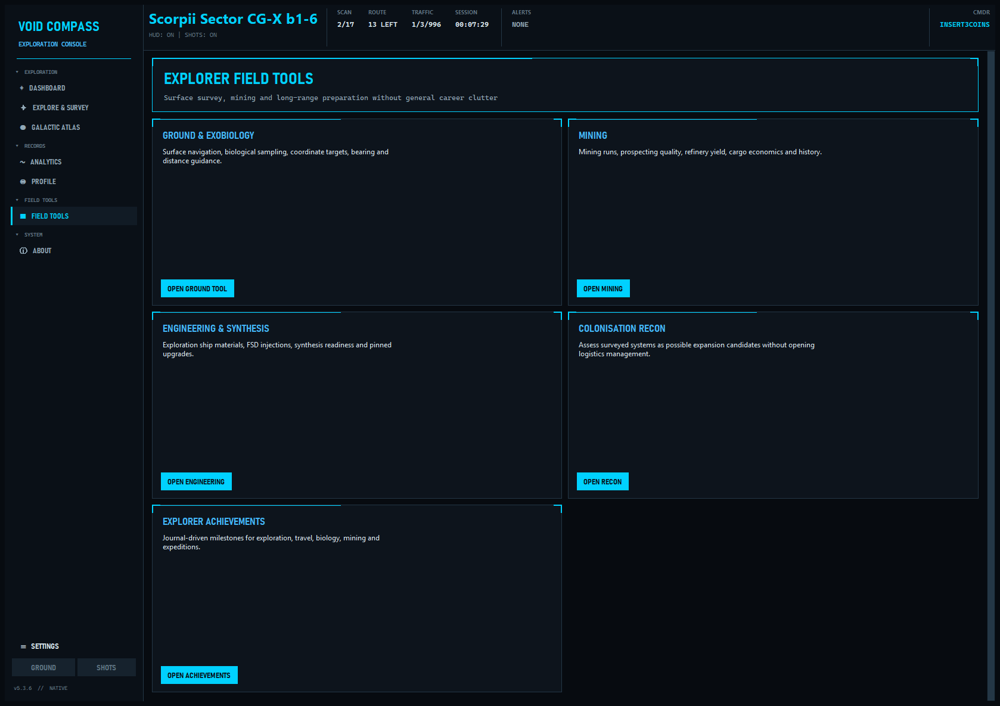

# Void Compass

**Current version: 5.3.7**

Void Compass is an exploration-first companion for Elite Dangerous. It turns Frontier's live journal, status and companion files into a persistent command dashboard, deep survey intelligence, expedition planning and native in-game overlays.

[Download releases](https://github.com/insert3coins/VoidCompass/releases) · [Read the wiki](https://github.com/insert3coins/VoidCompass/wiki) · [Report an issue](https://github.com/insert3coins/VoidCompass/issues/new/choose)

Windows is the primary native release. A native Linux x86-64 build is also available for testing; neither build requires Python to be installed.

## At a glance

- **Exploration command deck** — live flight, route, traffic, survey, discovery value, expedition and next-action intelligence in one view.
- **Exploration-focused navigation** — seven clear destinations keep survey, map and commander records prominent while a small Field Tools page supports surface work and mining.
- **Deep Survey** — explainable FSS, DSS, biological and geological progress; a Bio Field Assistant; discovery-significance ratings; valuable bodies; system architecture; revisit targets; Colonisation Recon and a searchable discovery archive.
- **Galactic Atlas** — a fully offline Milky Way map with all 42 Universal Cartographics regions, routes, travel history, smart clusters, intelligence layers and commander annotations.
- **Native overlays** — themed, profile-aware HUDs with mouse passthrough, global hotkeys and a visual Overlay Layout Studio.
- **Quiet by design** — native overlays, toasts and a curated flight log provide useful feedback without cockpit chatter, speech synthesis or an AI service.
- **Explorer field tools** — a touchdown-anchored Surface Survey Trail, Ground/Exobiology, Mining, exploration Engineering/Synthesis, Colonisation Recon and focused Achievements remain available without turning the app into a general career suite.

The Dashboard is a single live exploration briefing: Current Survey, one unified game-route/waypoint Next Leg, three ranked Next Actions, Expedition Pulse, Discovery Summary and the curated Flight Log. It reflows on narrower windows and adapts only for Mining, Surface Survey, Carrier Expeditions and Station/Data Sale activity. Automatic mode can be manually locked, while raw Frontier journal events remain secondary diagnostics.


*The exploration briefing keeps the current survey, route, priorities, expedition and discovery record together above the curated Flight Log.*

## Command workspaces

| Group | Direct workspaces |
| --- | --- |
| **Exploration** | Dashboard, Explore & Survey and Galactic Atlas. Explore uses four clear pages—System Survey, Expedition, Discoveries and Logbook—with its Expedition page providing the live command centre, routes, objectives, field readiness and detailed mission tools. |
| **Records** | Analytics and Profile. |
| **Field Tools** | Ground/Exobiology, Mining, Engineering/Synthesis, Colonisation Recon and Explorer Achievements. |
| **System** | About and Settings. |

Every group starts expanded, can be collapsed deliberately, remembers that choice per commander and remains reachable through a themed scrolling rail on smaller windows. Full secondary workspaces are still created only when first opened.

Settings is focused on the application itself: profiles and themes, journal paths, integrations, Adaptive Command, overlays and hotkeys, diagnostics, journal cache maintenance and first-run setup. Voice packs, personas, learned cockpit memory and speech controls are no longer part of the active application.

### Deep Survey Intelligence

Explore integrates profile-local Deep Survey intelligence directly into its four workflow pages, built from Frontier journal facts:

- **System Survey** combines the current body list, explainable FSS/DSS/biology completion matrix, ranked action queue, architecture, stellar wonders and Colonisation Recon in one filterable view. The Bio Field Assistant ranks unfinished worlds and reports live sample progress, spacing, terrain, value and first-footfall evidence; measured bodies receive an explainable significance tier and score. Its evidence inspector compares live, profile-database, Deep Survey, cached EDSM and traffic facts and can repair only the selected system from local journals without triggering uploads.
- **Expedition** uses one compact section switcher for route overview, waypoints, neutron planning, named Mission Control and Route Intelligence. The embedded Field Computer estimates the return journey and monitors route endurance without inventing missing module, service or material facts.
- **Discoveries** is one searchable archive for system history, valuable bodies, all 42 passport regions, Codex discoveries, FSS signals, DSS probe efficiency and screenshot metadata; image previews load only when selected, while system records can be copied or opened directly in EDSM.
- **Logbook** places the live trip summary, reliable resume checkpoint, automatic milestones and retained session debriefs together instead of separating them across Chronicle tabs. Its Explorer Data Vault separates unsold cartographic value, biological value and possible first-discovery bonus from recent sale evidence, while reports can be saved as Markdown or a themed local PNG share card.


*System Survey combines verified completion, the action queue, missed-discovery revisit work, system architecture, body detail and Colonisation Recon.*

Expedition Overview acts as a live command centre, combining current-leg navigation, route progress, objectives, survey yield, unsold data, return planning, ship readiness and recent activity without replacing the detailed Mission Control, Waypoints or Route Intelligence tools.



*Expedition Command brings the current leg, route safety, return plan, ship readiness, objectives and recent field activity into one live overview.*

Named expeditions persist across sessions with journal-verified goals, multi-session statistics, prioritised bookmarks and revisit targets. Thirteen ready-made templates range from focused region, value, biology, sector, Codex, photography and mixed-survey goals to long-range cartography, exobiology field seasons, sector mapping, regional science, Outer Rim discovery and full galactic-circumnavigation campaigns. Applying a larger campaign extends matching objectives in place, preserving their verified progress instead of creating duplicate counters. Departing a system can add worthwhile unfinished mapping, biology or FSS evidence to the Missed Discoveries queue, which links directly to its Revisit map layer and expedition bookmarks. Their active strip remains visible across Explore, while verified progress appears through the native feed, toasts and expedition panels. The flat Galactic Atlas combines original game-style Milky Way artwork with the complete 42-region Universal Cartographics layout. It works fully offline, supports retained-system, region and annotation search, natural drag movement, cursor-centred zoom, Atlas/Route Focus/Current Vicinity framing and an in-place full-window focus mode, and overlays profile-local travel breadcrumbs, game and waypoint routes, direction arrows, an optional return trail plus Valuable, Biology, Codex, Photo, Recon, Revisit, Bookmark, custom Annotation and bounded Expedition Sector records. Notes, danger warnings, regions of interest, survey targets and waypoints can be placed directly on the map; zoom-aware cluster badges keep dense histories legible, while a restrained ship pulse, planned-route tracer and next-waypoint beacon add live navigation context without rebuilding the cached atlas. Sector cells retain surveyed and incomplete evidence while untouched cells are sampled for responsive galaxy-wide control. Visible-image cropping keeps navigation responsive, while expedition plans can be exchanged as VoidCompass JSON or newline waypoint lists and full locally generated Markdown reports include the named route, objectives, evidence and bookmarks.


*The integrated Galactic Atlas showing the offline Milky Way layer, 42 regions, profile-local travel history, route tracers, clusters, filters and current-ship position.*

Explore remembers its active page, survey/discovery filters and Expedition section independently for each commander. Colonisation Recon produces a conservative survey-readiness dossier, saved candidate list and direct Architect Command handoff; it does not claim that survey readiness guarantees game eligibility. System architecture follows journal `Parents` relationships, while wonders detection flags unusual measured characteristics without inventing missing orbits.

Existing journals are indexed on a background worker the first time Deep Survey opens for a profile. Stored collections, expedition facts and visible rows are bounded so a long expedition does not turn map, ledger or startup recovery into a cockpit stall.

Void Compass deliberately leaves trade-route planning to dedicated services. It does not download a galaxy market dump, listen to the live EDDN feed or maintain a local price database. The independent **EDDN Community Market Upload** option remains in **Settings → Integrations**, publishing only fresh markets that the commander visits in game.

### Explorer Field Tools

Mining is the single intentional side activity. Its journal-driven workspace records prospector quality, refinery and cargo yield, core cracks, limpets and their observed cost, attributable commodity sales, hourly performance and per-commander history; the Prospector Analysis overlay remains a first-class cockpit surface. The Ground tool starts a temporary, profile-isolated trail at touchdown, records meaningful walking/SRV movement and bio sample sites, then shows distance and bearing back to the ship or makes the landing point the active ground target. Ground/Exobiology, exploration Engineering/Synthesis, Colonisation Recon and exploration/mining achievement packs complete the focused Field Tools page without exposing general Combat, Powerplay, Squadron or BGS workspaces.



*The deliberately compact Field Tools hub keeps Ground/Exobiology, Mining, exploration Engineering, Colonisation Recon and Explorer Achievements available without crowding the primary rail.*

Carrier Command plots Fleet and Squadron Carrier routes through Spansh, can import an existing Fleet Carrier result URL or job, marks journal-confirmed arrivals complete and advances Copy Next to the first pending jump, and carries route/fuel progress into the carrier overlay. Its Tritium view finds known hotspots around the carrier through Spansh and can copy or add a selected system to the expedition; its Cargo view combines the exact journal cargo total with an explicitly labelled manual/observed commodity manifest and active market orders.

## Adaptive Command Deck

Void Compass keeps the Dashboard centred on exploration: Current Survey exposes FSS, DSS, biological and geological progress; Next Leg resolves both Elite routes and saved waypoints through one source; Next Actions ranks three verified priorities; Expedition Pulse tracks the active named campaign; and Discovery Summary retains value, first-discovery, surface-signal and notable-body evidence. Its focused activity modes are General Flight, Exploration, Mining, Surface Survey, Carrier Expedition and Station/Data Sale. Broader journal facts may still be retained for profile continuity and universal safety handling, but no longer create dashboard objectives or modes.

Each mode can apply a focused overlay scene while gravity, toast and heartbeat safety feedback remains available. Automatic detection can be locked to a chosen mode per commander, and overlay scenes can be disabled independently in **Settings → Command Deck**.

## Native overlays

Every overlay can be enabled independently, dragged to a saved position and styled with the active theme:

- Readable Classic Navigation HUD with the original stacked cockpit structure, a large current-system readout, distinct Game/Waypoint/Void route context, distance-proportional cyan/orange hop pips, permanent FSS progress, live fuel plus biology/geology evidence, far-right day/week/total traffic, state-aware sampling/body/surface/docking context, a 9-point readability floor and optional CRT effects.
- Survey Operations with persistent body targets, biological and geological signals, species/sample progress, completed discoveries and notable-world value evidence; Navigation remains the single owner of system scan percentage.
- A dynamic Cargo Manifest with hold utilisation plus mission/stolen distinctions; Fleet/Squadron Carrier Command with jump, expedition, Tritium and capacity status; and Prospector Analysis with themed material composition, core and refinery evidence.
- System Intelligence and Station Link overlays for contextual system, service and data-sale information without duplicating the Navigation HUD.
- Gravity, touchdown/liftoff, on-foot and other low-noise safety notifications.
- Toast notifications and the journal activity heartbeat pulse.

**Settings → Core → Open Overlay Layout Studio** opens the single overlay-control workspace. Its Layout view enables or disables every module and provides a scaled desktop preview: drag overlay cards to position the real HUD windows without disabling mouse passthrough. Saved positions remain authoritative through dynamic redraws, and activity modes never hide an enabled overlay. Its Overlay Settings view owns passthrough, compact HUD, overlay text scale, alert policy, auto-hide timing, gravity threshold and Navigation HUD CRT controls. Layout snapping, resets and named commander-specific presets remain available alongside those controls; application scale and reduced motion remain under **Settings → Core → Accessibility**.

On Windows, profile-aware global shortcuts can open or close the Layout Studio and temporarily hide or restore all overlays while Elite has focus, with optional individual shortcuts for the main exploration and field overlays. The low-conflict defaults are **Ctrl+Alt+Shift+F10** for Layout Studio, **Ctrl+Alt+Shift+F11** for all overlays and **Ctrl+Alt+Shift+F12** for a field bookmark at the current system/body; assignments can be changed or cleared on the dedicated **Settings → Hotkeys** page without changing which modules are enabled. Linux X11/XWayland builds retain borderless topmost overlays with opaque themed backgrounds; chroma transparency, mouse passthrough and system-wide shortcuts remain Windows-only.

| Navigation HUD | Fleet Carrier HUD |
| :---: | :---: |
|  |  |

*Current Navigation and Fleet Carrier overlays. Enabled overlays remain visible regardless of Dashboard mode and retain their commander-specific positions.*

## Achievements and commander profiles

Achievement progress, exploration history, named expeditions, bookmarks, Captain's Log, Deep Survey records, carrier state, engineering plans, mining history, routes and integration settings are separated by commander profile. The active commander is detected from the journal and can be changed without mixing personal data.

Commander Record can create SQLite-safe manual profile backups and schedule a restore for the next application start. VoidCompass also retains five rotating internal safety snapshots before version changes and cache rebuilds; a restore first preserves the replaced profile as a rollback snapshot.


*Explorer Achievements keeps the active packs centred on exploration, travel, exobiology, expeditions, carriers, colonisation and mining.*

## Native feedback

Void Compass deliberately keeps feedback visual and deterministic. Survey changes, significant discoveries, route progress and safety events appear through the appropriate overlay, toast or curated Flight Log entry without spoken callouts, personas, learned cockpit behaviour or background speech generation. Existing profile-local memory and voice-cache files from older releases are left untouched for safe rollback, but are no longer loaded or used.

## Integrations

- **Elite journal and companion files** provide all live game state.
- **EDSM** upload and traffic lookup are optional and use per-commander credentials; accepted stored-fleet snapshots, ship movements and belt-cluster celestial scans are included while mining prospect events remain filtered.
- **EDDN** can optionally receive fresh commodity snapshots from markets visited in game. Uploads include the commander name as EDDN uploader ID plus game version, system, station and commodity data; Void Compass does not download the EDDN feed.
- **Spansh** supports neutron routes, ring/hotspot searches, material-trader lookups and integrated Fleet/Squadron Carrier route calculation.
- **Discord webhooks** announce personal or Squadron Carrier operations with compact event-specific, active-theme cards. Completed and current locations can link to EDSM, while a newly plotted jump remains plain text until arrival. Automatic posts keep only the jump, Tritium and relevant expedition context; a deliberate manual status post provides the fuller capacity, docking, service and route snapshot. User-entered notes cannot trigger Discord mentions, and carrier finances remain local.

Void Compass does not require an account or Void Compass cloud database. It checks GitHub Releases for a newer version at startup; other network integrations only run when their associated feature is enabled or requested. Retired Trade data from an older installation is ignored and is never opened, updated or deleted by Void Compass.

## First run, recovery and diagnostics

New installations open a short themed setup for the Elite journal folder, overlays, mouse passthrough and Adaptive Command. This is the only visible window and finishes before profile state, overlays or journal catch-up start. Settings can rerun it at any time.

State-heavy journal bursts are buffered through a coalescing background writer, while one bounded dispatcher protects Tk from cross-thread UI work. Closing Void Compass uses one short, bounded final-state flush. A profile-local session marker detects an unclean shutdown and restores the last graceful interface snapshot while journal catch-up settles. Dashboard and Settings expose Command Health queue status.

**Settings → Diagnostics → Create Support Bundle** produces a ZIP in the `logs` folder with version and health information, sanitized runtime/crash diagnostics, and only journal event names and timestamps. It excludes raw journal payloads, commander identity, profile identifiers, credentials and webhook URLs.

Packaged releases create `config.json`, commander profiles and logs beside the executable. If journal detection fails, set `journal_path` in Settings. The normal Windows location is:

```text
C:\Users\<You>\Saved Games\Frontier Developments\Elite Dangerous
```

The native Linux x86-64 build is currently a **testing release**. It detects Elite running through Steam/Proton in standard Steam, Flatpak Steam and custom Steam-library prefixes. A typical journal path is:

```text
~/.local/share/Steam/steamapps/compatdata/359320/pfx/drive_c/users/steamuser/Saved Games/Frontier Developments/Elite Dangerous
```

Windows and Linux are packaged as separate native builds; the Linux application does not run inside Proton. Extract its `.tar.gz` into a writable folder, make `VoidCompass` executable if necessary, and run it alongside Elite. On Windows, `build_linux.cmd` launches the default WSL distribution, installs missing Ubuntu/Debian Tk and venv prerequisites, and creates the native Linux testing archive and checksum; it may request the Linux sudo password on its first run. Native Linux maintainers can run `bash build_linux.sh` directly. The manual GitHub Actions workflow provides the same checksummed artifact because PyInstaller builds must be created separately on each operating system. Linux testers are encouraged to report distribution, desktop session and overlay details with any issue.

## Contributing and support

Bug reports and feature ideas use the repository's structured [issue forms](https://github.com/insert3coins/VoidCompass/issues/new/choose). Before contributing code, see [CONTRIBUTING.md](CONTRIBUTING.md) and the [Code of Conduct](CODE_OF_CONDUCT.md). Suspected vulnerabilities must be reported privately according to the [Security Policy](SECURITY.md).

## License

Copyright © 2026 insert3coins. Void Compass is free software released under the [GNU General Public License v3.0 only](LICENSE). You may use, study, modify and redistribute it under those terms; redistributed source or binaries must preserve the GPL and provide the corresponding source as required by the licence. The corresponding source is published at [github.com/insert3coins/VoidCompass](https://github.com/insert3coins/VoidCompass).

The packaged offline galactic-region raster retains its upstream MIT notice in [THIRD_PARTY_NOTICES.md](THIRD_PARTY_NOTICES.md).

## Disclaimer

Void Compass is an independent community project and is not affiliated with or endorsed by Frontier Developments. Elite Dangerous and its related marks belong to their respective owners.
